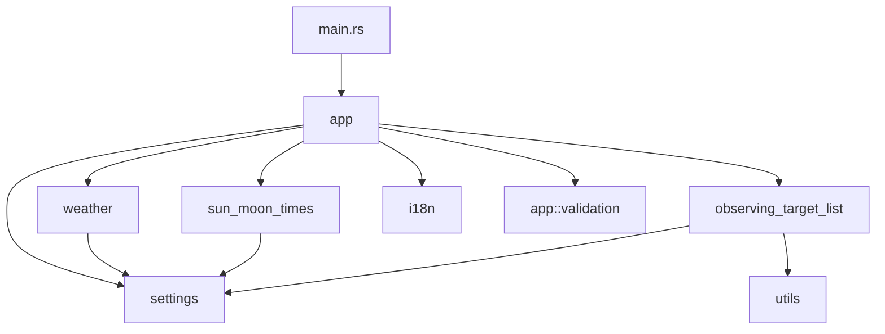

# Architecture

asteroid-tui is a terminal application built in Rust. The binary runs a full-screen [Ratatui](https://ratatui.rs/) UI; library modules fetch external data and read observatory settings from disk.

## Component overview

## Modules

| Module | Role |
|--------|------|
| `app` | Ratatui event loop, keyboard handling, network-backed screen transitions |
| `app::render` | Themed drawing: header/body/footer shell, menus, tables, wizards |
| `app::theme` | Night-sky palette, rounded blocks, menu/table styles |
| `app::validation` | Input validators for scheduling and observatory forms |
| `settings` | Load/save `~/.config/asteroid_tui/config.toml` |
| `weather` | 7timer forecast API client |
| `sun_moon_times` | sunrise-sunset.org API client |
| `observing_target_list` | MPC What's Up HTML parsing |
| `utils` | Coordinate and visibility helpers |
| `i18n` | English/Italian UI strings |

## UI stack

- **ratatui** + **crossterm**: alternate-screen TUI with keyboard navigation, cyan/yellow theme, centered panels
- Network calls (`weather::prepare_data`, etc.) run synchronously on the main thread before switching to result screens (v1; the UI may freeze briefly during fetch)

## Configuration

On first run, `Settings::new()` creates `~/.config/asteroid_tui/config.toml` with defaults if the file is missing. See [config.example.toml](config.example.toml) for a commented template.

What's Up uses a scraped `authenticity_token` from the MPC form page, with a built-in fallback if scraping fails.

## External services

| Service | Used by | Requires |
|---------|---------|----------|
| [7timer.info](http://www.7timer.info/) | `weather` | Observatory lat/lon |
| [api.sunrise-sunset.org](https://api.sunrise-sunset.org/) | `sun_moon_times` | Observatory lat/lon |
| [MPC What's Up](https://www.minorplanetcenter.net/whatsup/) | `observing_target_list` | Network; observatory site parameters in config |

## Release and CI

- Local releases: `release.sh` (version bump, changelog, tag, push)
- Jenkins (`Jenkinsfile`): tests, build, optional crates.io/GitHub release on tagged commits
- GitHub Actions (`.github/workflows/`): build, clippy, rustdoc checks
