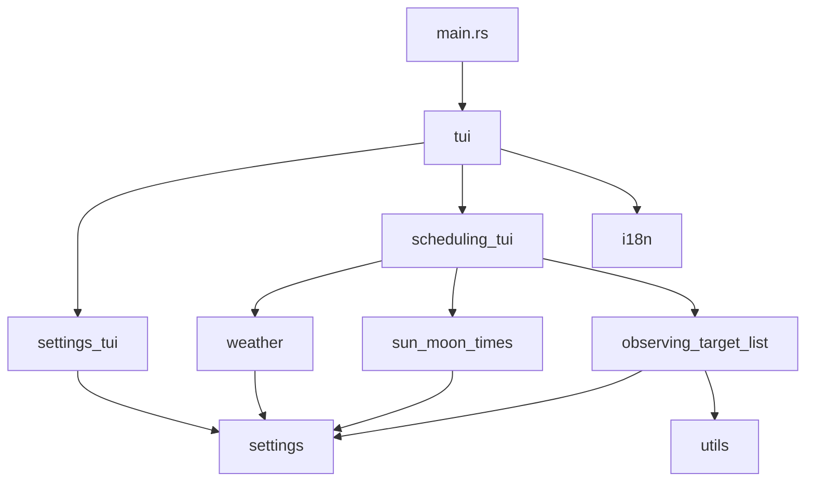

# Architecture

asteroid-tui is a terminal application built in Rust. The binary drives interactive menus; library modules fetch external data and read observatory settings from disk.

## Component overview

## Modules

| Module | Role |
|--------|------|
| `tui` | Main and settings menu loops |
| `settings_tui` | In-app editors for general and observatory options |
| `scheduling_tui` | Weather, sun/moon, and target-list flows |
| `settings` | Load/save `~/.config/asteroid_tui/config.toml` |
| `weather` | 7timer forecast API client and table rendering |
| `sun_moon_times` | sunrise-sunset.org API client |
| `observing_target_list` | MPC What's Up HTML parsing and tables |
| `utils` | Coordinate and visibility helpers |
| `i18n` | English/Italian UI strings |

## Configuration

On first run, `Settings::new()` creates `~/.config/asteroid_tui/config.toml` with defaults if the file is missing. See [config.example.toml](config.example.toml) for a commented template.

`MPC_AUTH_TOKEN` in the environment overrides `general.mpc_auth_token` in the config file.

## External services

| Service | Used by | Requires |
|---------|---------|----------|
| [7timer.info](http://www.7timer.info/) | `weather` | Observatory lat/lon |
| [api.sunrise-sunset.org](https://api.sunrise-sunset.org/) | `sun_moon_times` | Observatory lat/lon |
| [MPC What's Up](https://www.minorplanetcenter.net/whatsup/) | `observing_target_list` | MPC auth token, site parameters |

## Release and CI

- Local releases: `release.sh` (version bump, changelog, tag, push)
- Jenkins (`Jenkinsfile`): tests, build, optional crates.io/GitHub release on tagged commits
- GitHub Actions (`.github/workflows/`): build, clippy, rustdoc checks
